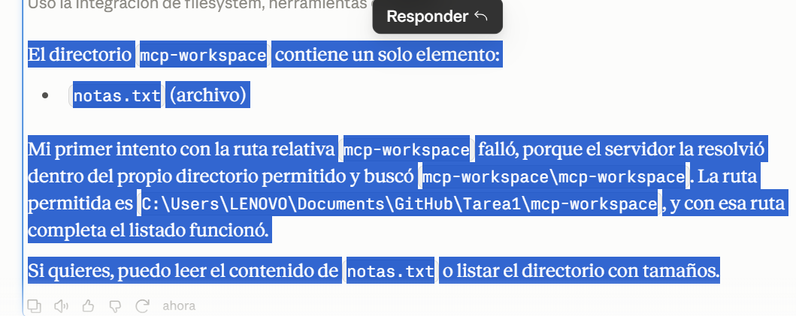
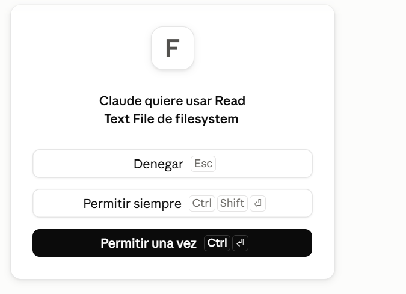
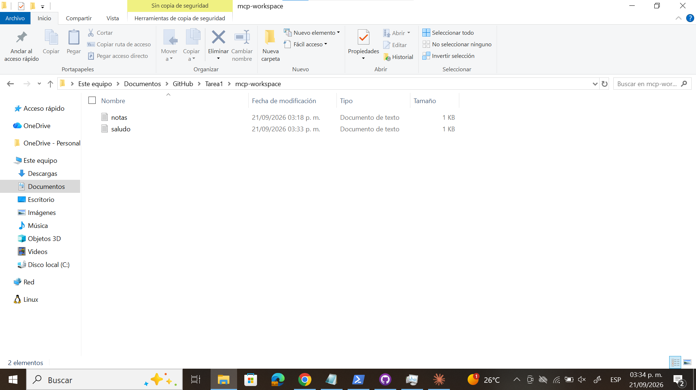
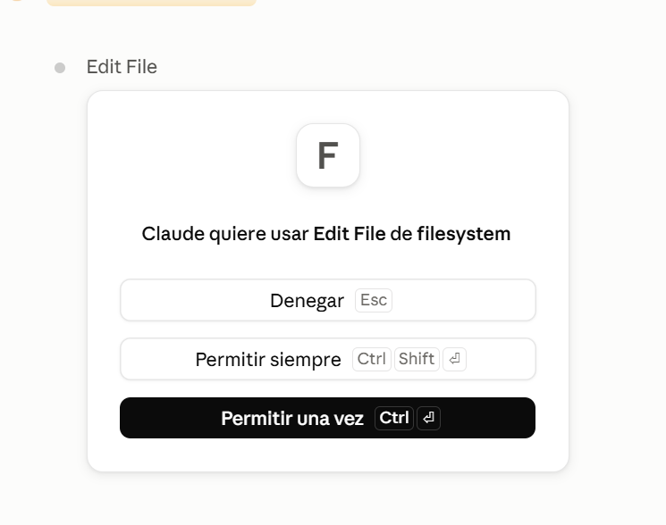
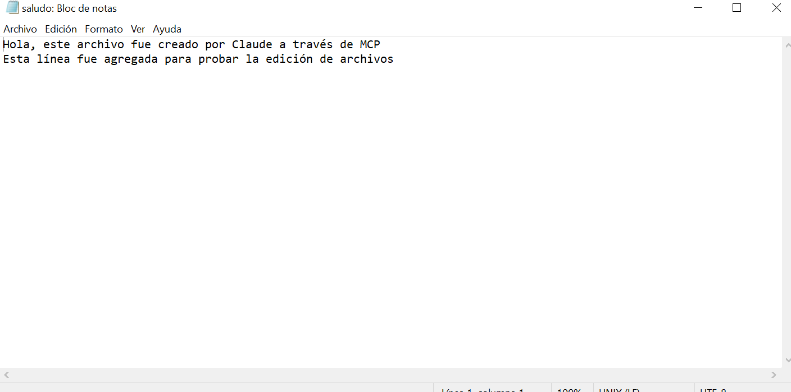
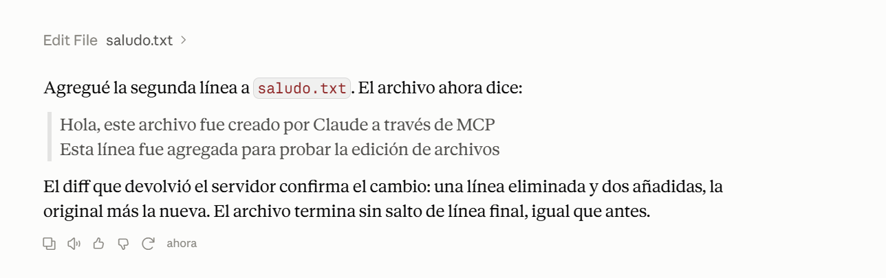
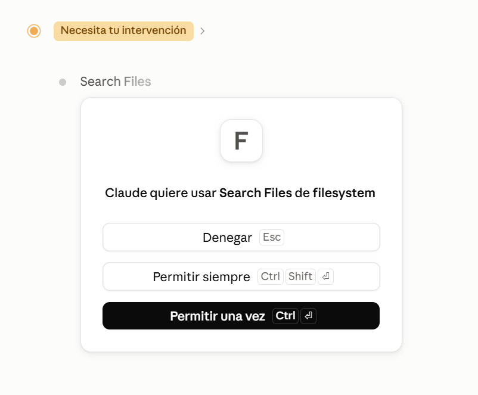
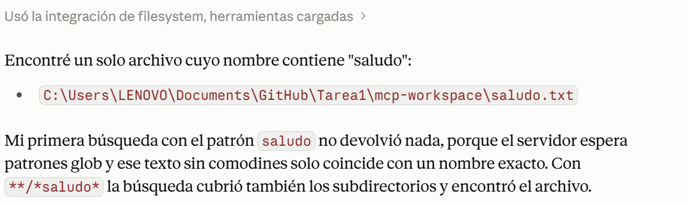
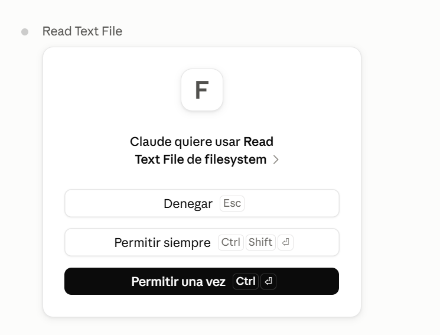
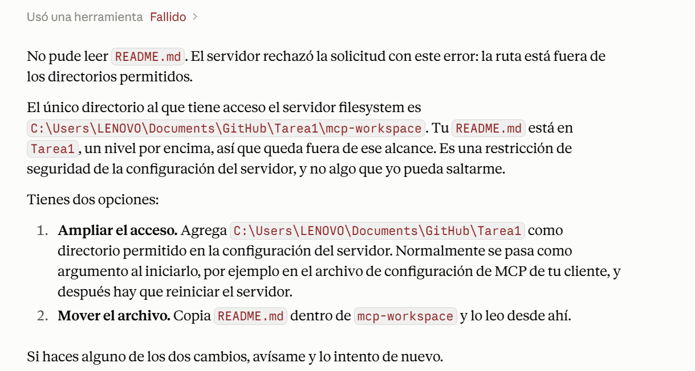

# TAREA 1.- MCP Y SISTEMA DE ARCHIVOS: INVESTIGACIÓN E IMPLEMENTACIÓN

## Portada
* **Nombre:** Téllez Girón Castro Ángel Ricardo
* **Boleta:** 2024630154
* **Grupo:** 7CV4
* **Asignatura:** Desarrollo de aplicaciones móviles nativas
* **Profesor:** Hurtado Avilés Gabriel 
* **Fecha de entrega:** 21/09/2026

---

## Resumen de la actividad

Este repositorio documenta la investigación y la implementación práctica del Model Context 
Protocol (MCP), un estándar abierto que permite a los modelos de lenguaje descubrir y utilizar herramientas externas en tiempo de ejecución, en lugar de depender de integraciones fijas escritas de antemano en el código como ocurre con una API tradicional.

La **Parte 1** (carpeta `docs/`) cubre la evolución de los modelos de lenguaje hacia los LLM y 
los modelos con razonamiento explícito, el problema del aislamiento de un LLM respecto al 
sistema de archivos, la comparación entre MCP y una API, la arquitectura del protocolo 
(host/cliente/servidor, primitivas y transportes), el servidor de referencia de sistema de 
archivos, los riesgos de seguridad asociados y sus mitigaciones, y ejemplos de herramientas 
actuales que implementan MCP.

La **Parte 2** documenta la instalación y configuración del servidor MCP de sistema de archivos 
en **Claude Desktop**, con evidencia fotográfica de las cinco operaciones requeridas (listar, 
leer, crear, modificar y buscar archivos) y de la prueba del límite de seguridad.

## Índice de documentos (`docs/`)

| # | Documento | Contenido |
|---|---|---|
| 1 | [`01-evolucion-modelos.md`](docs/01-evolucion-modelos.md) | Evolución de LM a LLM y modelos con razonamiento explícito |
| 2 | [`02-problema-aislamiento.md`](docs/02-problema-aislamiento.md) | Por qué un LLM no puede ver ni modificar archivos por sí mismo |
| 3 | [`03-mcp-vs-api.md`](docs/03-mcp-vs-api.md) | MCP frente a una API, con tabla comparativa |
| 4 | [`04-arquitectura-mcp.md`](docs/04-arquitectura-mcp.md) | Modelo host/cliente/servidor, primitivas y transportes |
| 5 | [`05-servidor-filesystem.md`](docs/05-servidor-filesystem.md) | El servidor de referencia de sistema de archivos |
| 6 | [`06-seguridad.md`](docs/06-seguridad.md) | Riesgos y mitigaciones de seguridad en MCP |
| 7 | [`07-casos-de-uso.md`](docs/07-casos-de-uso.md) | Herramientas actuales que implementan MCP |

---

## Tabla comparativa: MCP frente a una API

*(Desarrollo completo de este punto en [`docs/03-mcp-vs-api.md`](docs/03-mcp-vs-api.md))*

| Aspecto                              | MCP                                                                                                                                           | API                                                                                                                                |
| ------------------------------------ | --------------------------------------------------------------------------------------------------------------------------------------------- | ---------------------------------------------------------------------------------------------------------------------------------- |
| **¿Quién decide qué se invoca?**     | El LLM o agente puede decidir qué herramienta utilizar según la solicitud del usuario.                                                        | La aplicación cliente decide qué endpoint o función de la API debe invocar.                                                        |
| **Descubrimiento de capacidades**    | El servidor MCP puede proporcionar información sobre las herramientas y recursos disponibles.                                                 | Generalmente se consultan mediante documentación de la API, como Swagger/OpenAPI.                                                  |
| **Acoplamiento cliente-servicio**    | Menor acoplamiento, ya que diferentes clientes compatibles con MCP pueden utilizar servidores MCP mediante un protocolo común.                | Mayor acoplamiento, porque el cliente debe conocer los endpoints, parámetros y reglas específicas de la API.                       |
| **Formato de los mensajes**          | Utiliza mensajes estructurados basados en **JSON-RPC**.                                                                                       | No existe un único formato obligatorio; son comunes **HTTP + JSON**, aunque también puede utilizarse XML, GraphQL, entre otros.    |
| **Autenticación y consentimiento**   | Puede manejar autenticación y autorización entre el cliente y el servidor, además de contemplar el consentimiento para determinadas acciones. | Depende de cada API. Puede utilizar API Keys, OAuth, JWT, Basic Auth u otros mecanismos.                                           |
| **Reutilización entre aplicaciones** | Una herramienta MCP puede utilizarse desde diferentes aplicaciones compatibles con MCP sin crear una integración específica para cada una.    | Una API puede reutilizarse entre aplicaciones, pero cada aplicación debe implementar la forma específica de comunicación con ella. |

**MCP no sustituye a las APIs.** Un servidor MCP normalmente funciona como una capa intermedia 
sobre una API, base de datos o sistema de archivos ya existente, permitiendo que un modelo pueda 
descubrir y utilizar esas capacidades de forma estandarizada:

```text
LLM / Agente
     ↓
   MCP
     ↓
    API
     ↓
  Servicio
```

---

## Parte 2: Implementación 

### 1. Elección del cliente: Claude Desktop

Se eligió **Claude Desktop** como cliente MCP porque ofrece soporte nativo del protocolo sin 
necesidad de extensiones adicionales, expone claramente el catálogo de servidores conectados 
desde su panel de configuración, y solicita confirmación explícita de la persona usuaria antes 
de ejecutar cualquier herramienta — lo cual permitió documentar tanto las operaciones normales 
como el comportamiento exacto del límite de seguridad que exige esta práctica.

### 2. Instalación y configuración

**Sistema operativo:** Windows 11

**Versiones utilizadas:**
- Claude Desktop: `2.2553.1`
- Node.js: `v24.15.0`
- npm: `11.12.1`
- Paquete del servidor: `@modelcontextprotocol/server-filesystem` (descargado automáticamente 
  vía `npx`, sin instalación manual)

**Paso 1: Instalar requisitos previos**

1. Instalar [Claude Desktop](https://claude.ai/download).
2. Instalar [Node.js](https://nodejs.org/) (v18 o superior). Verificar con:
```powershell
   node -v
   npm -v
```

**Paso 2: Crear el directorio de trabajo delimitado**

Dentro del repositorio clonado, crear la carpeta que será el único directorio accesible para 
el servidor:

```powershell
cd C:\Users\LENOVO\Documents\GitHub\Tarea1
mkdir mcp-workspace
"Este es un archivo de prueba para la práctica de MCP." | Out-File -Encoding utf8 mcp-workspace\notas.txt
```

> **Importante:** comitear esta carpeta a Git inmediatamente después de crearla. Una carpeta sin trackear puede perderse por acciones como "Discard changes" en GitHub Desktop — algo que ocurrió durante el desarrollo de esta práctica y obligó a recrearla (ver nota de troubleshooting más abajo).

**Paso 3: Editar el archivo de configuración de Claude Desktop**

**Contenido relevante agregado al archivo** (nota: en esta versión de Claude Desktop, el archivo 
también contiene claves de preferencias generales de la aplicación que no están relacionadas con 
MCP; solo se muestra aquí la clave `mcpServers`, que es la que agregamos):

```json
{
  "mcpServers": {
    "filesystem": {
      "command": "npx",
      "args": [
        "-y",
        "@modelcontextprotocol/server-filesystem",
        "C:\\Users\\LENOVO\\Documents\\GitHub\\Tarea1\\mcp-workspace"
      ]
    }
  }
}
```

> Este archivo **no contiene credenciales, llaves ni tokens**, ya que el servidor de filesystem no los requiere para operar. Una copia de este archivo se incluye en `config/claude_desktop_config.json` de este repositorio.

**Paso 4: Reiniciar Claude Desktop completamente**

Cerrar la aplicación desde el ícono de la bandeja del sistema (clic derecho → Salir), **no basta 
con cerrar la ventana**. Volver a abrirla.

**Paso 5: Verificar que el servidor está activo**

Ir a **Settings - Desarrollador**. Debe aparecer una tarjeta con el nombre `filesystem` y el 
estado **"En ejecución"**.

### 3. Operaciones demostradas

Cada operación se solicitó en lenguaje natural desde el chat de Claude Desktop, aprobando 
manualmente cada herramienta cuando la aplicación lo solicitó.

| # | Operación | Prompt usado | Herramienta invocada | Capturas |
|---|---|---|---|---|
| 1 | Listar directorio | "Lista el contenido de `mcp-workspace`" (ruta completa) | `list_directory` | `Imagenes/aprobacion.png`, `Imagenes/yo.png` |
| 2 | Leer archivo existente | "Lee el contenido de `notas.txt`" | `read_text_file` | `Imagenes/parte2.png` |
| 3 | Crear archivo y escribir contenido | "Crea un archivo `saludo.txt` con un texto de saludo" | `write_file` | `Imagenes/Yacreado.png` |
| 4 | Modificar archivo existente | "Agrega una segunda línea a `saludo.txt`" | `edit_file` | `Imagenes/verificaredicion.png`, `Imagenes/permisoeditar.png`, `Imagenes/Editada.png` |
| 5 | Buscar archivo | "Busca archivos cuyo nombre contenga 'saludo'" | `search_files` | `Imagenes/Permisobusca.png`, `i}Imagenes/busqueda.png` |

#### Evidencia fotográfica de las operaciones











**Notas de comportamiento observadas durante las pruebas** (relevantes para entender cómo opera realmente el servidor):

- **Rutas relativas:** al pedir listar `mcp-workspace` usando solo ese nombre (ruta relativa), 
  el servidor la resolvió *dentro* del propio directorio permitido, buscando 
  `mcp-workspace\mcp-workspace` y fallando. Usar la ruta absoluta completa 
  (`C:\Users\LENOVO\Documents\GitHub\Tarea1\mcp-workspace`) resolvió el problema.
- **Patrones de búsqueda:** `search_files` espera un **patrón glob**, no un texto simple. Buscar 
  `saludo` no devolvió resultados; el patrón `**/*saludo*` sí encontró el archivo correctamente.
- **write_file vs. edit_file:** `write_file` crea o sobrescribe un archivo completo, mientras que 
  `edit_file` aplica una edición puntual (tipo diff) sobre un archivo ya existente, sin sobrescribir todo su contenido.

### 4. Prueba del límite de seguridad

**Prompt usado:**
```
Lee el contenido del archivo C:\Users\LENOVO\Documents\GitHub\Tarea1\README.md
```
(una ruta un nivel por encima de `mcp-workspace`, fuera del directorio autorizado)

**Resultado obtenido:** la llamada a la herramienta falló. El servidor rechazó la solicitud 
indicando que la ruta está fuera de los directorios permitidos, ya que el único directorio 
accesible es `mcp-workspace`, y `README.md` se encuentra un nivel por encima, en `Tarea1/`.

**Capturas:** `Imagenes/limite.png`, `Imagenes/Pruebaexitosa.png`




**Mecanismo que impidió la operación:** el rechazo no depende de que el modelo "decida" no 
hacerlo ni de que la persona usuaria niegue un permiso desde la interfaz — de hecho, en esta 
prueba ni siquiera apareció el diálogo de aprobación, porque el servidor rechazó la ruta 
**antes** de completar la operación. El servidor de filesystem valida internamente cada ruta 
recibida contra su lista de directorios permitidos (configurada al arrancar el proceso, en el 
Paso 3) antes de ejecutar cualquier lectura o escritura. Esto confirma lo señalado en la sección 
de seguridad de este documento: el alcance limitado a un directorio es el mecanismo real de 
protección, independiente del comportamiento del modelo. El propio Claude lo reconoció 
explícitamente en su respuesta, aclarando que se trata de "una restricción de seguridad de la 
configuración del servidor, y no algo que yo pueda saltarme".

---

## Conclusiones personales

Esta práctica me dejó mucho más claro que un modelo de IA nunca toca el sistema de archivos 
directamente: solo decide qué herramienta pedir, y es el servidor —un programa completamente 
separado— el que ejecuta la acción real. Ver el diálogo de aprobación antes de cada operación 
hizo tangible algo que en la teoría suena obvio, pero que es fácil dar por sentado.

Lo más revelador no fueron los aciertos, sino los errores. Cuando la carpeta `mcp-workspace` 
desapareció por no estar bajo control de Git, entendí por qué el límite de directorios permitidos 
no es un detalle decorativo: es la única barrera real entre lo que el modelo puede tocar y todo 
lo demás en el sistema. Y cuando probé el límite de seguridad a propósito, confirmé que el 
rechazo no depende de que el modelo "se porte bien": es una validación que ocurre en el servidor, 
independiente de lo que el modelo intente hacer.

También me quedó clara la diferencia real entre MCP y una API: no es técnica, sino de quién 
decide. En una API tradicional esa decisión está fija en el código desde antes de ejecutarse; en 
MCP, el modelo la toma en el momento, según lo que la persona pidió en lenguaje natural.

---
## Referencias bibliográficas 

* Stryker, C. (2025, noviembre 26). Modelos de lenguaje de gran tamaño. Ibm.com. https://www.ibm.com/mx-es/think/topics/large-language-models
* (S/f). Cloudflare.com. Recuperado el 20 de septiembre de 2026, de https://www.cloudflare.com/es-es/learning/ai/what-is-large-language-model/
* Srinivasagan, G. (2025, enero 11). Evolution of language models. DEV Community. https://dev.to/gokulsg/evolution-of-language-models-163
* Ghaseminejad Raeini, M. (2025). The evolution of language models: From N-Grams to LLMs, and beyond. Natural Language Processing Journal, 12(100168), 100168. https://doi.org/10.1016/j.nlp.2025.100168
* (S/f-b). Dataversity.net. Recuperado el 20 de septiembre de 2026, de https://www.dataversity.net/articles/a-brief-history-of-large-language-models/
* Stryker, C. (2021, octubre 6). What are large language models (LLMs)? Ibm.com. https://www.ibm.com/think/topics/large-language-models
* Wang, Z., Chu, Z., Doan, T. V., Ni, S., Yang, M., & Zhang, W. (2025). History, development, and principles of large language models: an introductory survey. AI and Ethics, 5(3), 1955–1971. https://doi.org/10.1007/s43681-024-00583-7
* Gundersen, G. (s/f). A history of large language models. Gregorygundersen.com. Recuperado el 20 de septiembre de 2026, de https://gregorygundersen.com/blog/2025/10/01/large-language-models/
* Dang, K. (2023, noviembre 15). Language Model History — Before and After Transformer: The AI revolution. Medium. https://medium.com/@kirudang/language-model-history-before-and-after-transformer-the-ai-revolution-bedc7948a130
* QuarkAndCode. (2026, abril 26). A Brief History of Language Models: From Markov Chains to modern LLMs. Medium. https://medium.com/@QuarkAndCode/a-brief-history-of-language-models-from-markov-chains-to-modern-llms-30951b09cb08
* The history of large language models: From ELIZA to GPT-5. (s/f). Devot.Team. Recuperado el 20 de septiembre de 2026, de https://devot.team/blog/history-of-large-language-models
* Bergmann, D. (2025, agosto 7). ¿Qué es un modelo de razonamiento? Ibm.com. https://www.ibm.com/mx-es/think/topics/reasoning-model
* Ekole, M. (2025, febrero 20). Test-Time Compute for LLM Reasoning. Linkedin.com. https://www.linkedin.com/pulse/test-time-compute-llm-reasoning-mitterrand-ekole-ofege
* Huang, C. (2025, marzo 17). Understanding Reasoning Models & Test-Time Compute: Insights from DeepSeek-R1. Medium. https://medium.com/@cch.chichieh/understanding-reasoning-models-test-time-compute-insights-from-deepseek-r1-d30783070827
* (how) do reasoning models reason? (s/f). En arXiv. Recuperado el 20 de septiembre de 2026, de https://arxiv.org/html/2504.09762v1
* Raschka, S. (2026, julio 18). Controlling reasoning effort in LLMs. Ahead of AI. https://magazine.sebastianraschka.com/p/controlling-reasoning-effort-in-llms
* Chen, M. (2025, febrero 24). ¿Qué es una API (interfaz de programación de aplicaciones)? Oracle. Oracle.com. https://www.oracle.com/latam/cloud/cloud-native/api-management/what-is-api/
* Networks, R. [@RaiolaNetworks]. (s/f). Model context protocol (MCP), explicado para principiantes [[Object Object]]. Youtube. Recuperado el 21 de septiembre de 2026, de http://youtube.com/watch?v=3SL2-I7_EnE&t=51
* Model Context Protocol. (2025). Especificación del Model Context Protocol, revisión 2025-11-25. Anthropic. https://modelcontextprotocol.io/specification/2025-11-25
* A03 injection - OWASP top 10:2021. (s/f). Owasp.org. Recuperado el 21 de septiembre de 2026, de https://top10.owasp.org/2021/A03_2021-Injection/
* Banach, Z. (s/f). Injection attacks in application security: Types, examples, prevention. Invicti.com. Recuperado el 21 de septiembre de 2026, de https://www.invicti.com/blog/web-security/top-dangerous-injection-attacks
* CWE - CWE-22: Improper limitation of a pathname to a restricted directory ('path traversal’) (4.20). (s/f). Mitre.org. Recuperado el 21 de septiembre de 2026, de https://cwe.mitre.org/data/definitions/22.html
* Path Traversal. (s/f). Owasp.org. Recuperado el 21 de septiembre de 2026, de https://community.owasp.org/attacks/Path_Traversal
* (S/f). Owasp.org. Recuperado el 21 de septiembre de 2026, de https://owasp.org/projects/web-security-testing-guide/v41/4-Web_Application_Security_Testing/05-Authorization_Testing/01-Testing_Directory_Traversal_File_Include
* Identra. (2025). What are the security risks of MCP (Model Context Protocol)?https://www.identra.ai/glossary/mcp-security/
* Model Context Protocol. (2025). Security Best Practices. Especificación del Model Context Protocol, revisión 2025-11-25. https://modelcontextprotocol.io/specification/2025-11-25/basic/security_best_practices
* Open Web Application Security Project (OWASP). (2025). OWASP Top 10 for Agentic Applications.https://owasp.org/
* Supertrained. (2026). Why prompt injection hits harder in MCP: Scope constraints and blast radius. DEV Community.https://dev.to/supertrained/why-prompt-injection-hits-harder-in-mcp-scope-constraints-and-blast-radius-5d8o
* Zealynx. (2026). The 5 things that will get your MCP server hacked: A security checklist.https://www.zealynx.io/research/adversarial-security/mcp-security-checklist
* Dave, A. I. (2025, julio 17). Top 10 Model Context Protocol use cases: Complete guide for 2025. DaveAI. https://www.iamdave.ai/blog/top-10-model-context-protocol-use-cases-complete-guide-for-2025/
* Model context protocol (MCP). (s/f). Google Antigravity Docs. Recuperado el 21 de septiembre de 2026, de https://antigravity.google/docs/mcp/
* Codex Community [@CodexCommunity]. (s/f). Top 10 MCP use cases - using Claude & model context protocol [[Object Object]]. Youtube. Recuperado el 21 de septiembre de 2026, de https://www.youtube.com/watch?v=lzbbPBLPtdY
* Tools. (s/f). Modelcontextprotocol.info. Recuperado el 21 de septiembre de 2026, de https://modelcontextprotocol.info/docs/concepts/tools/
* What is Model Context Protocol (MCP)? A guide. (s/f). Google Cloud. Recuperado el 21 de septiembre de 2026, de https://cloud.google.com/discover/what-is-model-context-protocol
* Beura, R. K. (2025, octubre 4). Top 5 MCP Server Platforms: A Comprehensive Developer’s Guide to the model context protocol…. Medium. https://medium.com/@ommranjit/top-5-mcp-server-platforms-a-comprehensive-developers-guide-to-the-model-context-protocol-35772bab5312


